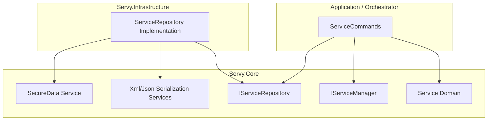
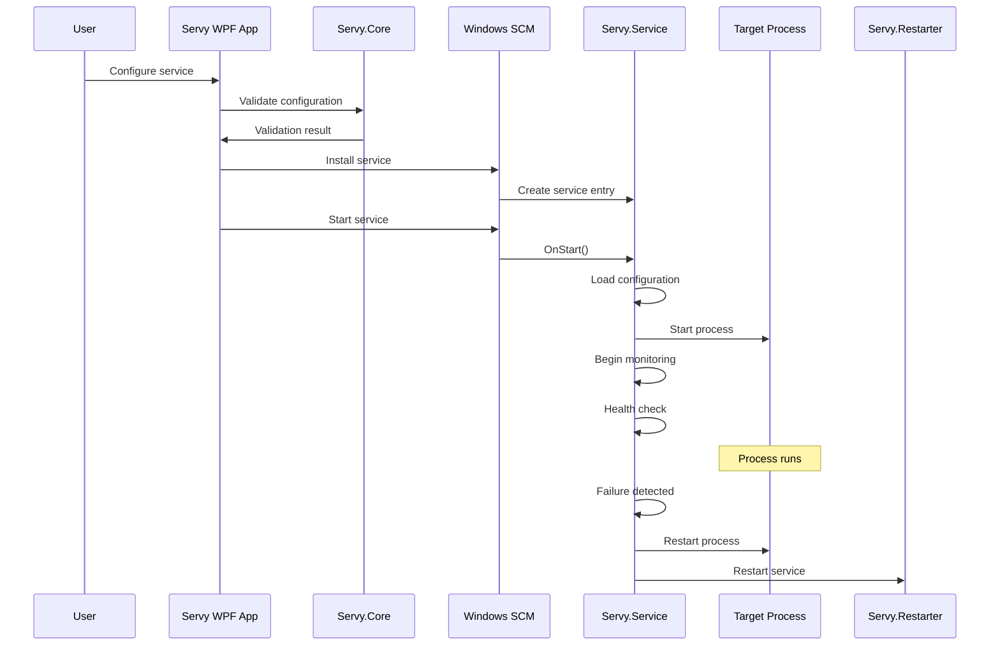

## 目录

1. [概述](#overview)
1. [技术栈](#technology-stack)
1. [项目结构](#project-structure)
1. [架构分层](#architecture-layers)
1. [项目详解](#project-details)
1. [集成流程](#integration-flow)
1. [设计模式](#design-patterns)
1. [测试](#tests)
1. [贡献](#contributing)

## Overview

Servy 是一款 Windows 应用程序，可通过简洁的 CLI、PowerShell 模块或 GUI 界面将任意可执行文件作为 Windows 服务运行。它为最新环境（**Windows 10 1809+**、**Windows 11** 以及 **Windows Server 2016+**）提供可靠方案，同时通过专用的 **.NET Framework 4.8** 构建，对旧版基础设施（**Windows 7 SP1**、**Windows 8**、**Windows 8.1** 以及 **Server 2008 R2+**）保持深度兼容。

作为 NSSM 与 WinSW 的下一代替代方案，Servy 采用 C# 构建，以确保透明性与模块化。代码库严格按核心逻辑、服务管理与 UI 层分离组织，便于在未来的 .NET 演进中长期维护。

Servy 提供两个版本，各自维护在独立分支上：

* **.NET 10.0+ 版本：** 位于 [`main`](https://github.com/aelassas/servy/tree/main) 分支
* **.NET Framework 4.8 版本：** 位于 [`net48`](https://github.com/aelassas/servy/tree/net48) 分支

## Technology Stack

### 核心技术
* **现代构建：** .NET 10.0+（面向当前 Windows 10 (1809+) / 11 / Server 2016+ 的主框架）。
* **旧版构建：** .NET Framework 4.8（为兼容 Windows 7 SP1 / 8 / 8.1 / Server 2008 R2+ 而维护）。
* **WPF（Windows Presentation Foundation）：** 驱动桌面应用与 Servy Manager 界面。
* **Windows API：** 直接集成服务生命周期与 ACL 管理。

### 开发与自动化
* **C#：** 核心与 UI 开发的主要语言。
* **PowerShell：** 通过 `Servy` 模块提供高层自动化。
* **Inno Setup：** 用于生成已签名、可投产的安装包。

### 系统要求

| 要求 | 现代构建（默认） | 旧版构建（net48） |
| :--- | :--- | :--- |
| **操作系统** | Windows 10 (1809+) / 11 / Server 2016+ | Windows 7 SP1 / 8 / 8.1 / Server 2008 R2+ |
| **运行时** | 已包含 — 自包含（无需单独安装） | .NET Framework 4.8 |
| **体系结构** | x64 / ARM64 | x64 |
| **权限** | 管理员 | 管理员 |

## Project Structure

Servy 解决方案由八个主要项目组成：


| 项目 | 类型 | 说明 |
|---------|------|-------------|
| **Servy** | WPF 应用程序 | 用于服务配置与管理的主用户界面 |
| **Servy.Manager** | WPF 应用程序 | 用于管理与监控已安装服务的主用户界面 |
| **Servy.UI** | WPF 类库 | 共享组件、服务与 WPF 工具 |
| **Servy.CLI** | 控制台应用程序 | 用于服务配置与管理的主 CLI |
| **Servy.Core** | 类库 | 共享功能、工具与数据模型 |
| **Servy.Infrastructure** | 类库 | 数据访问、持久化以及与外部系统的集成（例如 SQLite 数据库） |
| **Servy.Service** | Windows 服务 | 包装目标进程的 Windows 服务可执行文件 |
| **Servy.Restarter** | 控制台应用程序 | 服务重启工具 |

## Architecture Layers

Servy 遵循整洁架构（Clean Architecture）原则，将职责划分到不同层级，以提高清晰度、可维护性与可测试性：

```text
┌───────────────────────────────────┐
│                                   │
│         Presentation Layer        │
│                                   │
│    (Servy Apps - GUI & CLI)       │
│ Handles user interaction, input,  │
│ and output. Communicates with the │
│ business logic layer.             │
│                                   │
├───────────────────────────────────┤
│                                   │
│        Business Logic Layer       │
│                                   │
│            (Servy.Core)           │
│ Implements the core functionality,│
│ workflows, and service management │
│ rules, independent of UI.         │
│                                   │
├───────────────────────────────────┤
│                                   │
│       Infrastructure Layer        │
│                                   │
│     (Servy.Infrastructure)        │
│ Provides data persistence, access │
│ to the SQLite database, and       │
│ external system integration.      │
│                                   │
├───────────────────────────────────┤
│                                   │
│           Service Layer           │
│                                   │
│          (Servy.Service)          │
│ A Windows Service host that runs  │
│ configured apps in the background,│
│ monitors them, and applies health │
│ checks and restart policies.      │
│                                   │
└───────────────────────────────────┘
```

上图展示了 Servy 遵循整洁架构原则的分层结构。中心是核心层（`Servy.Core`），包含领域实体（`Service`）、抽象/接口（`IServiceRepository`、`IServiceManager`）、XML/JSON 序列化以及数据加密。外部服务与 API 在此引用，遵循依赖倒置原则。该层不依赖外部依赖，确保业务逻辑保持解耦且可测试。



基础设施层（`Servy.Infrastructure`）实现核心层接口，提供如数据库持久化（`ServiceRepository`）等具体功能。

应用层或编排层协调领域操作，调用仓储与服务，本身不包含业务规则。按整洁架构的说法，依赖指向内层核心，从而即使基础设施变化，内部领域仍保持稳定。

这种分离有利于灵活测试、更易维护与更好的适应性，因为领域逻辑不依赖具体实现或框架。

## Project Details

### Servy（桌面应用）

主 WPF 应用提供创建与管理 Windows 服务的用户界面。应用采用 MVVM（Model-View-ViewModel）设计模式，以确保关注点清晰分离与可维护的代码架构。

**主要职责：**
* 提供友好的 WPF 界面用于服务配置
* 处理用户输入校验
* 与 Windows 服务控制管理器（Service Control Manager）通信
* 管理服务的安装、卸载与配置
* 处理 UAC 提权请求

**主要功能：**
* 服务名称与描述配置
* 启动类型选择（Automatic、AutomaticDelayedStart、Manual、Disabled）
* 进程优先级设置（Idle 至 Real Time）
* CPU 亲和性
* 自定义工作目录与参数
* 输出重定向与日志轮转
* 健康检查与自动服务恢复
* 环境变量
* 服务依赖
* 启动前与启动后钩子
* 停止前与停止后钩子
* 管理员权限管理

### Servy Manager

Servy Manager 是用于管理通过 Servy 创建的 Windows 服务的图形界面。它以直观、集中的方式安装、配置与控制服务，并将全部配置持久化到本地数据库。与直接使用 Windows 服务控制管理器（SCM）不同，Servy Manager 增加了便利性、高级功能与结构化的服务管理。

**主要职责：**
* 将服务信息持久化到本地数据库，以保持已安装与已导入服务的一致视图
* 提供友好界面管理服务生命周期（安装、编辑、启动、停止、重启、复制 PID、卸载、移除）
* 允许将服务配置导入数据库而无需立即安装
* 提供在应用内直接查看与编辑服务配置的工具
* 与日志集成，使监控与排查服务更快、更高效

**主要功能：**
* 服务列表：查看 Servy 中已安装或已导入的全部服务
* 服务控制：从 UI 启动、停止与重启服务
* 服务安装：从配置文件安装服务，在不再需要时卸载或移除
* 导出：以 XML 或 JSON 格式保存服务配置
* 导入：将服务配置加入数据库而无需立即安装
* 配置编辑器：直接从界面打开并编辑服务配置
* 搜索：按名称或属性快速定位服务
* 性能：通过实时性能图监控服务的 CPU 与内存使用
* 控制台：实时预览服务的 stdout 与 stderr 输出
* 依赖：预览服务依赖
* 日志：按日志级别、日期与关键字高级筛选浏览服务日志

### Servy CLI（CLI）

Servy CLI 为高级用户与自动化场景提供基于文本的界面，用于创建、配置与管理 Windows 服务。它通过支持脚本、CI/CD 集成与无界面使用，对主 WPF 应用形成补充。

**主要职责：**
* 通过命令行参数与脚本配置 Windows 服务
* 在无 UI 的情况下安装、卸载、启动、停止与查询服务
* 支持全部服务设置（名称、描述、启动类型、优先级、工作目录、参数）
* 以编程方式管理输出重定向与日志轮转
* 在需要时请求 UAC 提权
* 返回有意义的退出码，便于脚本自动化与错误处理

**主要功能：**
* 完整的服务生命周期管理（安装、卸载、启动、停止）
* 服务配置（名称、描述、启动类型：Automatic/AutomaticDelayedStart/Manual/Disabled）
* 进程优先级调整（Idle 至 Real Time）
* CPU 亲和性
* 自定义工作目录与命令行参数
* `stdout`/`stderr` 重定向及日志轮转选项
* 健康监控与自动服务恢复触发
* 环境变量
* 服务依赖
* 启动前与启动后钩子
* 停止前与停止后钩子
* 导出/导入服务配置
* 面向脚本、CI/CD 流水线与远程管理
* 管理员权限检测与提权支持

**Note:**
CLI 设计为轻量、对脚本友好的 WPF 界面替代方案，聚焦自动化与无界面场景，同时与 GUI 应用共享核心服务管理逻辑。

### Servy.UI
充当共享 UI 基础设施与组件库。它提供“粘合层”，使 `Servy`（桌面应用）与 `Servy.Manager`（管理器应用）能够共享一致的架构、行为与视觉风格。

**主要职责：**
* **AppBootstrapper：** 编排应用生命周期，管理用于应用关闭的 `CancellationTokenSource`，并处理 UI 专用服务的依赖注入（DI）注册。
* **MVVM 基础设施：** 提供 Model-View-ViewModel 模式的基础实现，包括 `ViewModelBase`、`RelayCommand`，以及带 `IsBusy` 信号的 `AsyncCommand`。
* **WPF 服务：** 包含无法放入 Core 库的 UI 专用交互抽象，例如 `IFileDialogService`（打开/保存对话框）、`IMessageBoxService`（模态提示）、`IHelpService`、`ICursorService` 以及 `IUiDispatcher`（UI 线程调度）。
* **值转换器：** 集中 UI 格式化逻辑，包括内存使用、CPU 指标以及服务状态到颜色映射的专用转换器。
* **设计时 Mock：** 提供设计时数据源，使 XAML 设计器无需连接服务控制管理器（SCM）或 SQLite 数据库即可可视化复杂布局。

### Servy.Core（核心库）

跨全部项目使用的共享库，包含通用功能。

**主要职责：**
* 实现通用工具与辅助类
* 定义接口与契约

**核心组件：**
* `ServiceManager` - 提供安装、卸载、启动、停止、重启与更新 Windows 服务的方法。
* `ServiceControllerWrapper` - 定义用于控制与监控 Windows 服务状态的抽象。
* `NativeMethods` - 提供用于 Windows 服务管理、进程生命周期控制与安全权限的全面 Win32 API 定义、结构体与常量集合。
* `WindowsServiceApi` - 提供调用原生 Windows 服务 API 函数的抽象。
* `Win32ErrorProvider` - 提供对最近 Win32 错误码的访问。
* `RotatingStreamWriter` - 按文件大小或日期自动轮转日志，将文本写入文件。
* `SecureData` - 提供线程安全的认证加密（Encrypt-then-MAC）。
* `SecurityHelper` - 提供管理文件系统安全与访问控制列表（ACL）的工具方法。
* `ServiceValidationRules` - 为全部 Servy 组件提供集中的服务配置校验逻辑。
* `PathSecurityGuard` - 提供用于评估、解析与净化文件系统路径的集中式静态安全门控。
* `ImportGuard` - 为配置文件提供共享的导入侧门控：路径安全、大小阈值，以及从已校验流读取内容。

### Servy.Infrastructure（基础设施层）

**基础设施层**实现于 `Servy.Infrastructure` 项目中，负责全部**数据持久化与检索操作**。

#### 职责

* **数据库访问** - 与 Servy 的 SQLite 数据库交互（默认位于 `%ProgramData%\Servy\db\` 中的 `Servy.db`）。
* **数据持久化** - 读写服务配置、日志及相关元数据。

#### Dapper ORM

Servy.Infrastructure 使用 [Dapper](https://github.com/DapperLib/Dapper)（面向 .NET 的轻量对象关系映射器）将数据库行映射为强类型 C# 对象。

**在 Servy 中使用 Dapper 的主要好处：**

* **性能** - 相对原始 ADO.NET 开销极小，适合高频查询。
* **简洁** - 允许直接编写 SQL，以获得清晰度与控制力。
* **类型安全** - 自动将查询结果映射到 Servy 的 DTO 与实体类。

#### 使用模式

1. **定义 SQL 查询** - 查询在仓储类中显式编写。
2. **用 Dapper 执行** - 使用 `IDbConnection` 配合 Dapper 扩展方法，如 `Query<T>()` 与 `Execute()`。
3. **返回映射对象** - 结果作为 DTO 返回给业务逻辑层（`Servy.Core`）。
```cs
public virtual async Task<ServiceDto?> GetByNameAsync(
    string? name,
    bool decrypt = true,
    CancellationToken cancellationToken = default)
{
    if (string.IsNullOrWhiteSpace(name)) return null;

    string sql = $"SELECT * FROM {SqlConstants.ServicesTableName} WHERE Name = @Name COLLATE UNICODE_NOCASE;";
    var dto = await ResolveByNameAsync<ServiceDto?>(sql, name, cancellationToken: cancellationToken);

    if (decrypt) SafeDecrypt(dto);
    return dto;
}

private Task<T?> ResolveByNameAsync<T>(
    string sql,
    string name,
    CancellationToken cancellationToken)
{
    return ResolveWithLegacyFallbackAsync(
        sql: sql,
        queryExecutor: (executedSql, parameters) => _dapper.QuerySingleOrDefaultAsync<T>(executedSql, parameters, cancellationToken: cancellationToken),
        name: name,
        fallbackEvaluationPredicate: result => EqualityComparer<T?>.Default.Equals(result, default),
        cancellationToken: cancellationToken
    );
}

private static async Task<T?> ResolveWithLegacyFallbackAsync<T>(
    string sql,
    Func<string, object, Task<T?>> queryExecutor,
    string name,
    Func<T?, bool> fallbackEvaluationPredicate,
    CancellationToken cancellationToken)
{
    cancellationToken.ThrowIfCancellationRequested();

    var result = await queryExecutor(sql, new { Name = name.Trim() });

    // Legacy rows (Servy <= 8.3) stored Name with whitespace verbatim.
    if (fallbackEvaluationPredicate(result) && name != name.Trim())
    {
        cancellationToken.ThrowIfCancellationRequested();
        result = await queryExecutor(sql, new { Name = name });
    }

    return result;
}
```
**Note:** `Name` 查找先用修剪后的名称查询，再回退到原样名称，以便仍能找到旧版行（Servy <= 8.3，存储时未修剪）。

通过将全部持久化逻辑保留在 `Servy.Infrastructure` 中，Servy 保持**关注点分离**，确保更高层（Core、CLI、GUI）不依赖底层存储机制。

### Servy.Service（Windows 服务）

包装并管理目标进程的 Windows 服务可执行文件。

**主要职责：**
* 充当 Windows 服务宿主
* 启动并管理目标可执行文件
* 处理进程监控与重启逻辑
* 重定向 `stdout`/`stderr` 并支持轮转
* 应用进程优先级、CPU 亲和性与工作目录设置
* 健康检查与自动服务恢复
* 运行启动前与启动后钩子
* 运行停止前与停止后钩子
* 处理服务生命周期操作
* 防止孤儿/僵尸进程并确保资源清理

**服务生命周期：**
1. **OnStart** - 加载配置，启动目标进程，向 SCM 注册 SERVICE_ACCEPT_PRESHUTDOWN。
2. **OnCustomCommand(SERVICE_CONTROL_PRESHUTDOWN)** - 针对操作系统重启/关机的高优先级拆解（延长 SCM wait hint）。
3. **OnShutdown** - 最终关机通知（由操作系统控制的短窗口）。
4. **OnStop** - 标准 SCM 停止。

更多信息请参阅 [Shutdown & Teardown](./Shutdown-&-Teardown) 文档。

### Servy.Restarter（重启管理器）

专用于编排服务重启的进程外工具组件。正在运行的 Windows 服务无法通过服务控制管理器（SCM）安全地自行完成停止再启动循环，因此 `ServiceHelper.RestartService` 会将 `Servy.Restarter.exe` 作为独立进程启动，以干净地处理生命周期转换而不死锁。

**主要职责：**
* **进程外执行：** 通过命令行参数（`args[0]` 与 `args[1]`）接收目标服务名称以及可选的日志目录覆盖，使重启序列与正在停止的宿主进程解耦。
* **SCM 生命周期编排：** 使用 `ServiceController` 与 `IServiceRestarter` 接口与 SCM 交互，下发停止命令、等待服务完全拆解，再执行全新启动。
* **引导与缓解控制：** 初始化隔离的事件日志源，加载 `appsettings.restarter.json`（配置如 `RestartTimeoutSeconds` 等属性），应用 SQLite CVE-2025-6965 缓解检查，并设置专用的服务作用域日志。
* **退出码信号：** 若服务在配置的超时阈值内未能完成状态转换，则向 `ServiceHelper` 返回非零退出码以报告失败。
* **有界寿命：** 在严格执行窗口下运行 — 若编排超过 240 秒，宿主进程会强制终止 restarter。

## Integration Flow



## Design Patterns

Servy 架构运用了多种设计模式。

Servy 使用 **MVVM**，通过 ViewModel 将 UI（View）与业务逻辑（Model）分离。该模式在 Servy UI 与 Servy Manager 项目中广泛使用，尤其用于数据绑定与命令处理。

**工厂方法（Factory Method）** 模式出现在系统的许多部分。它用于创建诸如 `IServiceControllerWrapper`、`IProcessWrapper`、`IStreamWriter`、`ITimer` 以及各种基于 Dapper 的仓储对象等接口实例。这有助于使客户端代码与具体实现解耦。

**适配器（Adapter）** 模式用于多处包装系统类或内部工具。例如，`ServiceControllerWrapper` 将 `System.ServiceProcess.ServiceController` 适配为 `IServiceControllerWrapper`。`RotatingStreamWriterAdapter` 将 `Servy.Core.IO.RotatingStreamWriter` 包装在 `IStreamWriter` 接口之后。`TimerAdapter` 将 `System.Timers.Timer` 适配为 `ITimer`。Dapper 仓储也充当适配器，将原始 SQL 查询映射为强类型 DTO。

**策略（Strategy）** 模式贯穿于 `Service` 类。它依赖诸如 `IServyLogger`、`IProcessFactory`、`IStreamWriterFactory`、`ITimerFactory` 与 `IPathValidator` 等接口，各自代表日志、进程创建、流写入、定时或路径校验的不同策略。这些策略可在运行时替换。Dapper 仓储也会根据所执行的数据操作使用不同的查询策略。

架构同样应用了 **观察者（Observer）** 模式。`IProcessWrapper` 接口定义了诸如 `OutputDataReceived`、`ErrorDataReceived` 与 `Exited` 等事件，使其他组件能够观察并响应进程状态变化。

Servy 在代码库的许多部分采用 **依赖注入（Dependency Injection）**。`ServiceManager`、`ServiceCommands`、`Service` 以及仓储类等的构造函数以接口为参数，促进松耦合并使系统更易测试。该方法贯穿 `Servy.Core`、`Servy.Service`、`Servy.Infrastructure` 与 `Servy` 项目。

最后，**仓储（Repository）** 模式为 SQLite 数据库提供清晰抽象。Dapper 查询与命令封装在仓储类内部，因此 Core 与 Service 层可在强类型对象上操作，而无需了解任何 SQL 细节。

## Tests
Servy 的稳定性与可靠性通过全面的单元测试与集成测试套件得到保障。这些测试项目防止回归，并为引入新功能或重构现有逻辑提供信心。

| 项目 | 说明 |
| --- | --- |
| **Servy.UnitTests** | 测试用于配置与管理服务的主用户界面。 |
| **Servy.Manager.UnitTests** | 测试用于管理与监控已安装服务的界面。 |
| **Servy.UI.UnitTests** | 测试共享 UI 组件、辅助服务与 WPF 工具。 |
| **Servy.CLI.UnitTests** | 测试用于服务自动化与脚本的命令行界面。 |
| **Servy.Core.UnitTests** | 测试整个项目共用的共享逻辑、工具与数据模型。 |
| **Servy.Infrastructure.UnitTests** | 测试数据访问、持久化与 SQLite 数据库集成。 |
| **Servy.Service.UnitTests** | 测试包装并运行目标应用的 Windows 服务可执行文件。 |
| **Servy.Restarter.UnitTests** | 测试负责执行服务重启的工具。 |
| **Servy.Core.IntegrationTests** | 聚焦核心逻辑与外部系统依赖交互的集成测试。 |
| **Servy.Infrastructure.IntegrationTests** | 针对真实 SQLite 数据库的数据持久化集成测试（架构初始化与 Dapper 执行）。 |
| **Servy.Service.IntegrationTests** | 针对完整服务生命周期与进程管理行为的集成测试。 |
| **Servy.UI.IntegrationTests** | 针对 UI 工作流编排与导航逻辑的集成测试。 |
| **Servy.CLI.IntegrationTests** | 针对真实 CLI 进程执行的命令行界面集成测试。 |
| **Servy.Testing** | 包含供全部其他测试项目使用的通用测试工具的共享工具项目。 |

### 持续集成与覆盖率

每次推送到 `main` 都会通过 GitHub Actions 在 x64 与 ARM64 矩阵上触发自动化测试工作流（`test.yml`），并提供手动的 `workflow_dispatch` 入口。拉取请求由 `build.yml`（编译）与 `security.yml`（易受攻击包扫描）门控；完整测试套件在变更落地 `main` 后运行。代码覆盖率覆盖解决方案中的生产项目 — 包括核心库、基础设施模块、UI 组件与服务包装器 — 同时排除专用测试套件（`-*.UnitTests;-*.IntegrationTests;-Servy.Testing`）。

工作流与 Codecov 和 Coveralls 集成，基于主 x64 执行矩阵节点，提供测试健康状况与覆盖率趋势的历史视图。该 CI/CD 流水线确保合并的变更持续对照项目质量基线得到验证，维持平台所期望的稳定性与可靠性。

## Contributing

本架构文档是开源 Servy 项目的一部分。欢迎通过 GitHub issues 与 pull requests 改进文档或代码库。

有关使用 Servy 的更多信息，请参阅主 [README](https://github.com/aelassas/servy/blob/main/README.md) 文件。
